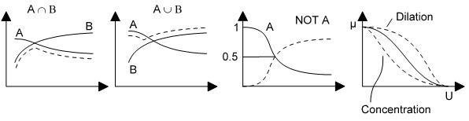

# USED FUZZY LOGIC OPERATIONS

#### INTERSECTION:

In the case of the intersection of crisp sets, we simply have to select common elements from both sets. In the case of fuzzy sets, when there are common elements in both the fuzzy sets, we should select the element with minimum membership value.

The intersection of two fuzzy sets A and B is a fuzzy set C , written as C = A ∩ B

C = A ∩ B = {(x, μA ∩ B (x)) | ∀x ∈ X}

μC(x) = μA ∩ B (x) = μA(x) ⋀ μB(x)

= min( μA(x), μB(x) ), ∀x ∈ X

#### UNION:
In the case of the union of crisp sets, we simply have to select repeated elements only once. In the case of fuzzy sets, when there are common elements in both the fuzzy sets, we should select the element with the maximum membership value.

The union of two fuzzy sets A and B is a fuzzy set C , written as C = A ∪ B

C = A ∪ B = {(x, μA ∪ B (x)) | ∀x ∈ X}

μC(x) = μA ∪ B (x) = μA(x) ∨ μB(x)

= max( μA(x), μB(x) ), ∀x ∈ X

#### COMPLIMENT:
Fuzzy complement is identical to crisp complement operation. Membership value of every element in the fuzzy set is complemented with respect to 1, i.e. it is subtracted from 1.

The complement of fuzzy set A, is denoted by AC, is defined as

AC = {(x, μAC (x)) | ∀x ∈ X}

AC (x) = 1 – μA(x)

#### CONCENTRATION:

If α > 1 then Aα → A decreases membership.

#### DILATION:

If α < 1 then Aα → A increases membership.

###### Note: If A is a crisp subset and α >0, then Aα = A

